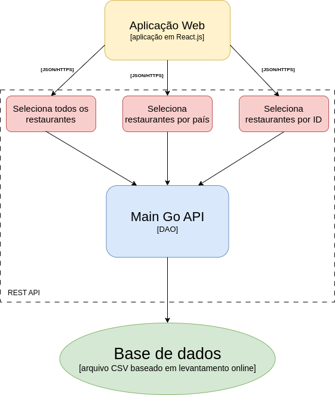

# culympics-paris

This project is a web platform developed for tourists to decide where they would like to eat, during the 2024 Olympic Games, in Paris, France.

## Contributors

- Antônio Hideto Borges Kotsubo - 236041
- Gabriel Alves de Arruda - 248132
- Guilherme Brentan de Oliveira - 252764

## Description

Culympics é um projeto desenvolvido para auxiliar turistas durante os Jogos Olímpicos de Paris em 2024. A plataforma oferece uma maneira fácil de encontrar restaurantes na cidade, permitindo aos usuários filtrar por culinária, visualizar a localização dos restaurantes em um mapa, ler avaliações de outros usuários e receber sugestões especiais.

## Arquitetura utilizada

Para o desenvolvimento do projeto, foi utilizado o estilo arquitetural de REST API, detalhado na imagem abaixo.
Foi criado uma Aplicação Web criada em React + TypeScript, alimentada por um servidor desenvolvido em Golang.
As APIs consomem os dados contido em um arquivo CSV, criado a partir de buscas e pesquisas feitas virtualmente.
Essas APIs são regidas por uma espécie de Controller, que monitora as ações correspondentes enviando as chamadas necessárias para o nosso DAO. 

## Padrão de Projeto

Expandindo a análise para o componente central da API REST, observamos a criação de um padrão de Projeto DAO, o Data Access Object.
Desta forma, encapsulamos o acesso ao Banco de Dados dentro de uma classe DAO, separando as regras de negócio com o acesso direto ao nosso Banco.
Assim, podemos alterar a persistência desses dados, sem atrapalhar a lógica de negócios utilizada. Imagine, por exemplo, que ao invés de um banco em um arquivo em CSV fosse, na verdade, um banco de dados realacional SQL. Nada disso importa para a lógica de negócio, apenas as informações retornadas que são relevantes. Com a DAO, essa divisão pode ser feita de forma direta e simplificada. 
