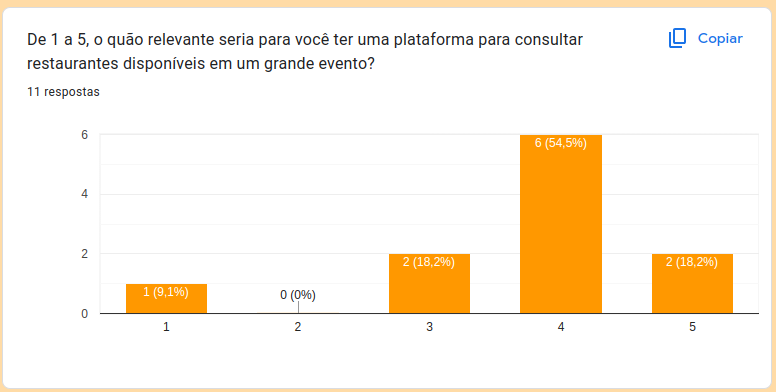
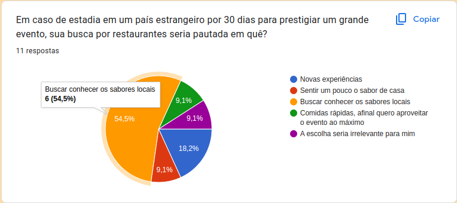
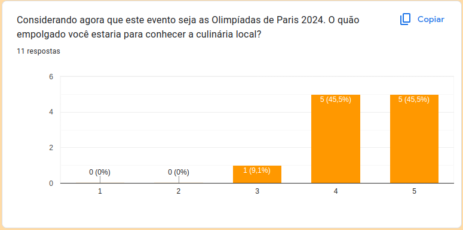
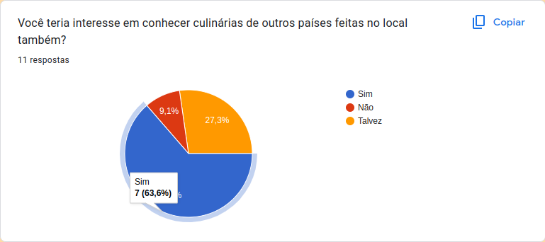

> Levantamento de Requisitos

- **Benchmarking** 

    Para iniciarmos o precesso de produção de requisitos, primeiramente demos início ao processo de Benchmarking.
    Este processo tinha por objetivo entender se:

    - A ideia do projeto fazia sentido para o que estávamos propondo;
    - Caso fizesse sentido, o que o nosso público mais iria consumir dentro da plataforma;
    - Quais são as prioridades do nosso público;
    - O que eles acham mais relevante ao lidar com uma plataforma de turismo culinário.

    Com isso em mente, criamos um formulário via Google Forms com os seguintes questionamentos:

    1. De 1 a 5, o quão relevante seria para você ter uma plataforma para consultar restaurantes disponíveis em um grande evento?
    2. Em caso de estadia em um país estrangeiro por 30 dias para prestigiar um grande evento, sua busca por restaurantes seria pautada em quê?
    3. Considerando agora que este evento seja as Olimpíadas de Paris 2024. O quão empolgado você estaria para conhecer a culinária local?
    4. Você teria interesse em conhecer culinárias de outros países feitas no local também?
    5. Para você, o que não poderia faltar em uma plataforma de turismo culinário feito especialmente para as Olimpíadas de Paris?

    Estas perguntas nos ajudaria a traçar requisitos que atendesse, da melhor forma possível, o público que visamos atingir.
    Além disso, nos preocupamos em criar um formulário conciso o suficiente para ser de fácil compreensão e rápido preenchimento.
    O forms pode ser acessdo por [aqui](https://forms.gle/Qhp25sTD3rNY1ht19).

- **Brainstorming** 

    Após a publicação do forms e da coleta de respostas por parte dos nossos futuros usuários, seguimos para um Brainstorming, cujo a finalidade seria traduzir os dados registrados para requisitos que agregassem valor ao nosso projeto.
    Após uma longa discussão entre os membros do time, foram definidos os requisitos iniciais que buscaremos cumprir.
    Um primeiro ponto importante foi o resultado da primeira pergunta: 72% dos perguntados considerariam relevante ou muito relevante possuir uma plataforma para turismo culinário em um grande evento. Isso apontava que nosso projeto possui um bom público alvo 
    
    

    1. **Filtros**

    A primeira parte da discussão foi pautada na análise do seguinte dado: 54,6% dos usuários gostariam de conhecer melhor os sabores locais. Em segundo lugar com cerca de 18% veio novas experiências. 

    

    Por conta disso, decidimos que a criação de dois filtros seria um requisito importante para o projeto. O primeiro deles, claramente, seria um filtro que trouxesse os melhores restaurantes da culinária local de Paris. Vale ressaltar que o fato de os jogos serem em Paris impulsionaram a ideia de criação desse filtro, já que quando perguntados diretamente sobre conhecer a culinária local francesa 90% dos entrevistados se disseram empolgados em conhecer a cultura local.

    

    Outro filtro que consideramos relevante, baseado na segunda pergunta foi o de novas experiências, ou seja, um filtro que trouxesse comidas típicas de variados países produzidos na França (uma churrascaria brasileira em Paris, por exemplo). A pergunta número 4 também reforça esse ponto.

    

    2. **Avaliações**

    Já com a quinta pergunta, conseguimos questionamentos muito importantes. Um tema que se repetiu bastante nessa pergunta foi a questão das avaliações. Coletar avaliações para ajudar outros usuários a escolher seu restaurante é um requisito que não pode faltar para muitos usuários. Com isso, montamos mais um requisito, o de colher avaliações de usuários.

    3. **Proximidade**

    Outro ponto que aparentou ser relevante, baseado na quinta pergunta, é a localização dos restaurantes. Com isso, chegamos a dois novos requisitos. A exibição de restaurantes em um mapa, ajudando os turistas e usuários da plataforma a se localizarem em Paris, e a uma tela própria na plataforma, que contenha os restaurantes mais próximos do usuário naquele momento.